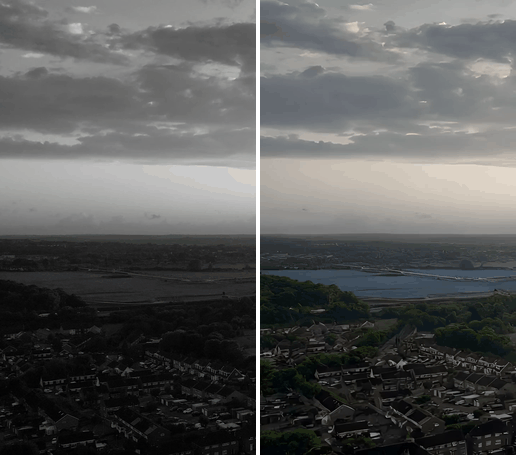

## 🔥 News

> **[May 16, 2026]** 🚀 **VEFX-Reward-32B is now publicly available!** Our 32B reward modelDownload it now: [🤗 viskoplatform/VEFX-Reward-32B](https://huggingface.co/viskoplatform/VEFX-Reward-32B). One-click inference: `VEFXReward("32B")`.

---

<div align="center">

# VEFX-Bench

### Benchmarking Generic Video Editing and Visual Effects

[📄 Paper](https://arxiv.org/abs/2604.16272) •
[💻 Code](https://github.com/Visko-Platform/VEFX-Bench) •
[🤗 Dataset](https://huggingface.co/datasets/xiangbog/VEFX-Bench) •
[🤗 Model (4B)](https://huggingface.co/xiangbog/VEFX-Reward-4B) •
[🤗 Model (32B)](https://huggingface.co/viskoplatform/VEFX-Reward-32B) •
[🏆 Leaderboard](https://vefx-leaderboard.com/) •
[🌐 Project Page](https://xiangbogaobarry.github.io/VEFX-Bench/)

</div>

**VEFX-Bench** is a comprehensive benchmark for evaluating text-driven video editing and visual effects. It includes **5,049 annotated examples** spanning **9 categories** and **32 subcategories**, evaluated by **VEFX-Reward** — a VLM-based reward model that scores edits across three dimensions on a 1–4 scale:

| Dimension | What it measures |
|---|---|
| **Instructional Following (IF)** | Does the edit accurately reflect the editing instruction? |
| **Render Quality (RQ)** | Visual clarity, temporal consistency, and physical plausibility |
| **Edit Exclusivity (EE)** | Were only the intended regions modified, without side-effects? |

---

## 🏆 Model Leaderboard

VEFX-Reward scores on 1–4 scale. Ranked by **GeoAgg** (α=2 for IF, β=1 for RQ, γ=1 for EE). Higher is better.

> **📅 Updated: May 2, 2026** — For the latest results & submissions, visit the **[live leaderboard →](https://vefx-leaderboard.com/)**

| Rank | Model | Type | IF ↑ | RQ ↑ | EE ↑ | GeoAgg ↑ |
|:---:|---|---|:---:|:---:|:---:|:---:|
| 🥇 | **Kling o3 Omni** | Commercial | 3.033 | **3.588** | 3.043 | **3.057** |
| 🥈 | **Kling o1** | Commercial | **3.040** | 3.534 | 2.976 | 2.985 |
| 🥉 | **Runway Gen-4.5** | Commercial | 2.817 | 3.319 | 2.923 | 2.912 |
| 4 | Seedance 2.0 | Commercial | 2.811 | 3.421 | 3.088 | 2.766 |
| 5 | Grok Imagine | Commercial | 2.606 | 3.346 | **3.376** | 2.723 |
| 6 | Luma Ray 3 | Commercial | 2.702 | 3.403 | 2.705 | 2.717 |
| 7 | UniVideo | Open-source | 2.294 | 3.266 | 3.091 | 2.516 |
| 8 | Wan 2.6 | Commercial | 2.012 | 3.317 | 2.446 | 2.146 |
| 9 | Luma Ray 2 | Commercial | 2.038 | 2.532 | 1.363 | 1.804 |
| 10 | VACE | Open-source | 2.027 | 3.172 | 1.180 | 1.775 |

---

## 🎬 Demo Videos

Each demo shows the **original video** (left) alongside the **edited video** (right).

<table>
<tr>
<td align="center"><b>Attribute Change</b><br><sub>"Change the color of the red industrial trailer to a bright yellow while maintaining the texture and appearance of the metal surface."</sub></td>
<td align="center"><b>Object Removal</b><br><sub>"Remove the woman with the grey backpack walking on the right side of the frame."</sub></td>
</tr>
<tr>
<td align="center"></td>
<td align="center"></td>
</tr>
<tr>
<td align="center"><b>Style Transfer</b><br><sub>"Restore the natural, realistic colors to the entire scene, replacing the current black and white style with a full-color rendition."</sub></td>
<td align="center"><b>Camera Motion</b><br><sub>"Perform a smooth zoom in on the distant snowy mountain peaks to create a more immersive view."</sub></td>
</tr>
<tr>
<td align="center"></td>
<td align="center"></td>
</tr>
</table>

---

## 📊 Benchmark at a Glance

| | |
|---|---|
| 📝 **5,049** Annotated Examples | 🎬 **1,419** Source Videos |
| 📂 **9 / 32** Categories / Subcategories | 🤖 **10** Editing Systems |
| 📐 **3** Quality Dimensions (IF, RQ, EE) | 🧪 **300** Benchmark Test Pairs |

---

## 🤗 VEFX-Reward Models

| Model | Backbone | Params | HuggingFace | Status |
|---|---|---|---|---|
| **VEFX-Reward-4B** | Qwen3-VL-4B-Instruct | 4B | [xiangbog/VEFX-Reward-4B](https://huggingface.co/xiangbog/VEFX-Reward-4B) | ✅ Available |
| **VEFX-Reward-32B** | Qwen3-VL-32B-Instruct | 32B | [viskoplatform/VEFX-Reward-32B](https://huggingface.co/viskoplatform/VEFX-Reward-32B) | ✅ Available |

> The 32B model needs ~65 GB VRAM in bfloat16. Use `VEFXReward("viskoplatform/VEFX-Reward-32B", device="cuda")` for one-line inference.

---

## 🚀 Quick Start

### Installation

```bash
conda create -n vefx-bench python=3.10 -y
conda activate vefx-bench

# Install PyTorch first (match your CUDA version)
# See https://pytorch.org/get-started/locally/ for the right command
pip install torch torchvision --index-url https://download.pytorch.org/whl/cu124

# Install remaining dependencies
pip install -r requirements.txt

# Install the package
pip install -e .
```

> **Requirements:** Python ≥ 3.10, CUDA GPU. The 4B model needs ~10 GB VRAM, the 32B model needs ~65 GB VRAM (bfloat16). Make sure your PyTorch CUDA version matches your driver.

### Pick your model size

```python
from vefx_reward import VEFXReward

# Fast / low-VRAM (~10 GB)
model = VEFXReward("xiangbog/VEFX-Reward-4B", device="cuda")

# Higher accuracy (~65 GB VRAM, e.g. a single H100 80 GB)
model = VEFXReward("viskoplatform/VEFX-Reward-32B", device="cuda")
```

### Score a Video Edit (Python API)

```python
from vefx_reward import VEFXReward

# 4B (default, ~10 GB VRAM)
model = VEFXReward("xiangbog/VEFX-Reward-4B", device="cuda")

# Or one-click 32B (highest accuracy, ~65 GB VRAM)
# model = VEFXReward("viskoplatform/VEFX-Reward-32B", device="cuda")
# model = VEFXReward("32B", device="cuda")  # same thing — short alias

scores = model.score(
    original_video="examples/sample_videos/object_removal_original.mp4",
    edited_video="examples/sample_videos/object_removal_edited.mp4",
    instruction="Remove the woman with the grey backpack walking on the right side of the frame.",
)
print(scores)
# {'IF': 2.34, 'RQ': 1.93, 'EE': 1.82, 'Overall': 6.09}
```

### CLI Usage

```bash
# 4B
python examples/quick_start.py \
    --original examples/sample_videos/object_removal_original.mp4 \
    --edited examples/sample_videos/object_removal_edited.mp4 \
    --instruction "Remove the woman with the grey backpack walking on the right side of the frame."

# 32B (one-click — alias automatically resolves to viskoplatform/VEFX-Reward-32B)
python examples/quick_start.py --model 32B --run_samples
```

### Score All Included Samples

The repo includes 4 sample video pairs with prompts. Score them all:

```python
import json
from vefx_reward import VEFXReward

model = VEFXReward("xiangbog/VEFX-Reward-4B", device="cuda")

with open("examples/sample_videos/prompts.json") as f:
    samples = json.load(f)

for sample in samples:
    scores = model.score(
        original_video=f"examples/sample_videos/{sample['original']}",
        edited_video=f"examples/sample_videos/{sample['edited']}",
        instruction=sample["instruction"],
    )
    print(f"[{sample['category']}] IF={scores['IF']:.2f}  RQ={scores['RQ']:.2f}  EE={scores['EE']:.2f}")
```

### Batch Scoring

Prepare a CSV with columns `original_video`, `edited_video`, `instruction`:

```bash
python examples/batch_scoring.py --csv edits.csv --output results.csv
```

### Multi-GPU Scoring

For large-scale evaluation across multiple GPUs:

```bash
python examples/multi_gpu_scoring.py --csv edits.csv --num_gpus 4 --output results.csv
```

---

## 📖 API Reference

### `VEFXReward`

```python
VEFXReward(
    model_path="xiangbog/VEFX-Reward-4B",  # HuggingFace ID or local path
    device="cuda",                           # "cuda", "cuda:0", "cpu"
    dtype=torch.bfloat16,                    # torch.bfloat16 or torch.float16
    fps=4.0,                                 # Video sampling rate
    max_frame_pixels=399360,                 # Max pixels per frame
)
```

#### `model.score(original_video, edited_video, instruction) → dict`

Score a single video edit. Returns `{'IF': float, 'RQ': float, 'EE': float, 'Overall': float}`.

#### `model.score_batch(original_videos, edited_videos, instructions) → list[dict]`

Score multiple edits sequentially. Each sample is processed independently to avoid OOM.

---

## 📝 Citation

```bibtex
@article{gao2026vefx,
  title={VEFX-Bench: A Holistic Benchmark for Generic Video Editing and Visual Effects},
  author={Gao, Xiangbo and Jiang, Sicong and Liu, Bangya and Chen, Xinghao and Yang, Minglai and Yang, Siyuan and Wu, Mingyang and Yu, Jiongze and Zheng, Qi and Wang, Haozhi and others},
  journal={arXiv preprint arXiv:2604.16272},
  year={2026}
}
```

## License

This project is licensed under the Apache License 2.0. See [LICENSE](LICENSE) for details.
